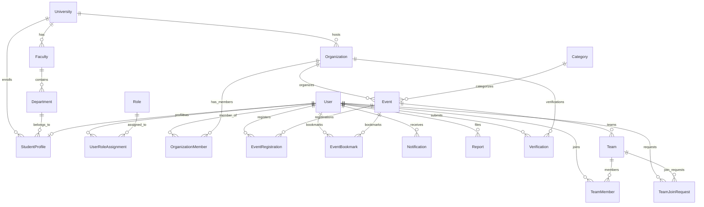

# CampusPulse Database Architecture Documentation

## 1. Overview

CampusPulse uses **PostgreSQL** as its primary relational database, accessed and managed via **Prisma ORM**.

### Architectural Highlights:

- **Primary Keys**: Collision-resistant `cuid()` strings for distributed safety and URL friendliness.
- **Relational Integrity**: Strict foreign key constraints with explicit `onDelete` cascades/set-null policies.
- **Composite Uniques**: Prevents duplicate relationships (e.g. duplicate user registrations for the same event, duplicate organization memberships, duplicate bookmarks).
- **Indexing Strategy**: Strategic indexes placed on lookup fields (`slug`, `code`, `email`), foreign keys, status filters (`status`, `is_active`), and sort keys (`start_date`, `created_at`).
- **Enums**: Native PostgreSQL enums for controlled sets of values.

---

## 2. Entity Relationship Diagram



---

## 3. Data Models Reference

### 3.1 Identity & User Domain

#### `users`

| Column              | Type        | Attributes           | Description                     |
| ------------------- | ----------- | -------------------- | ------------------------------- |
| `id`                | `TEXT`      | `PK`, `cuid()`       | Unique user identifier          |
| `email`             | `TEXT`      | `UNIQUE`, `NOT NULL` | Account email address           |
| `password_hash`     | `TEXT`      | `NULL`               | Hashed password (Argon2/bcrypt) |
| `name`              | `TEXT`      | `NOT NULL`           | Full display name               |
| `avatar_url`        | `TEXT`      | `NULL`               | Profile avatar image URL        |
| `is_email_verified` | `BOOLEAN`   | `DEFAULT false`      | Verified status                 |
| `is_active`         | `BOOLEAN`   | `DEFAULT true`       | Account active state            |
| `created_at`        | `TIMESTAMP` | `DEFAULT now()`      | Account creation timestamp      |
| `updated_at`        | `TIMESTAMP` | `auto-update`        | Last modified timestamp         |

_Indexes: `[email]`, `[is_active]`_

#### `roles` & `user_role_assignments`

- `roles`: `id`, `name` (`RoleType` UNIQUE: `STUDENT`, `ORGANIZER`, `FACULTY`, `ADMIN`, `SUPER_ADMIN`), `description`.
- `user_role_assignments`: Composite link `[user_id, role_id]`, unique per pair, cascading on user/role deletion.

#### `student_profiles`

| Column              | Type             | Description                                        |
| ------------------- | ---------------- | -------------------------------------------------- |
| `id`                | `TEXT`, `PK`     | Unique profile ID                                  |
| `user_id`           | `TEXT`, `UNIQUE` | 1-to-1 link to `users.id` (Cascade delete)         |
| `university_id`     | `TEXT`           | Foreign key to `universities.id` (Restrict delete) |
| `faculty_id`        | `TEXT`, `NULL`   | Foreign key to `faculties.id` (SetNull)            |
| `department_id`     | `TEXT`, `NULL`   | Foreign key to `departments.id` (SetNull)          |
| `student_id_number` | `TEXT`, `NULL`   | Student roll/registration number                   |
| `batch_year`        | `INT`, `NULL`    | Enrollment year (e.g. 2023)                        |
| `bio`               | `TEXT`, `NULL`   | Student summary/about                              |
| `github_url`        | `TEXT`, `NULL`   | Portfolio link                                     |
| `linkedin_url`      | `TEXT`, `NULL`   | Professional profile                               |
| `skills`            | `TEXT[]`         | Skill tags array                                   |
| `interests`         | `TEXT[]`         | Student interests array                            |

_Indexes: `[university_id]`, `[faculty_id]`, `[department_id]`_

---

### 3.2 Academic Hierarchy

#### `universities`

- Columns: `id`, `name`, `slug` (UNIQUE), `code` (UNIQUE), `country`, `city`, `logo_url`, `banner_url`, `domain` (UNIQUE), `website_url`, `description`, `is_verified`.
- _Indexes: `[slug]`, `[code]`_

#### `faculties`

- Columns: `id`, `university_id`, `name`, `slug`, `code`, `description`.
- _Constraints: UNIQUE `[university_id, slug]`, UNIQUE `[university_id, code]`_
- _Indexes: `[university_id]`_

#### `departments`

- Columns: `id`, `faculty_id`, `name`, `slug`, `code`, `description`.
- _Constraints: UNIQUE `[faculty_id, slug]`, UNIQUE `[faculty_id, code]`_
- _Indexes: `[faculty_id]`_

---

### 3.3 Organizations & Memberships

#### `organizations`

- Columns: `id`, `university_id` (NULL for inter-university orgs/companies), `name`, `slug` (UNIQUE), `description`, `type` (`OrgType`), `status` (`OrgStatus`), `logo_url`, `banner_url`, `email`, `website_url`, `is_verified`.
- _Indexes: `[university_id]`, `[slug]`, `[status]`, `[type]`_

#### `organization_members`

- Columns: `id`, `organization_id`, `user_id`, `role` (`OrgMemberRole`: `LEADER`, `MANAGER`, `MEMBER`), `title`, `joined_at`.
- _Constraints: UNIQUE `[organization_id, user_id]`_
- _Indexes: `[organization_id]`, `[user_id]`_

---

### 3.4 Categories & Events

#### `categories`

- Columns: `id`, `name` (UNIQUE), `slug` (UNIQUE), `type` (`OpportunityCategoryType`), `icon`, `description`.
- _Indexes: `[slug]`, `[type]`_

#### `events`

- Columns: `id`, `organization_id`, `category_id`, `title`, `slug` (UNIQUE), `short_description`, `description`, `banner_url`, `status` (`EventStatus`), `mode` (`EventMode`), `venue`, `meeting_url`, `start_date`, `end_date`, `registration_deadline`, `capacity`, `is_free`, `price`, `currency`, `tags`, `featured`.
- _Indexes: `[organization_id]`, `[category_id]`, `[status]`, `[start_date]`, `[featured]`, `[mode]`_

#### `event_registrations`

- Columns: `id`, `event_id`, `user_id`, `status` (`RegistrationStatus`), `notes`, `registered_at`, `updated_at`.
- _Constraints: UNIQUE `[event_id, user_id]`_
- _Indexes: `[event_id]`, `[user_id]`, `[status]`_

#### `event_bookmarks`

- Columns: `id`, `event_id`, `user_id`, `created_at`.
- _Constraints: UNIQUE `[event_id, user_id]`_
- _Indexes: `[event_id]`, `[user_id]`_

---

### 3.5 Team Finder

#### `teams`

- Columns: `id`, `event_id` (NULL for open study/project groups), `creator_id`, `name`, `description`, `max_members`, `is_open`.
- _Indexes: `[event_id]`, `[creator_id]`, `[is_open]`_

#### `team_members`

- Columns: `id`, `team_id`, `user_id`, `role` (`TeamRole`: `LEADER`, `MEMBER`), `joined_at`.
- _Constraints: UNIQUE `[team_id, user_id]`_

#### `team_join_requests`

- Columns: `id`, `team_id`, `user_id`, `status` (`TeamRequestStatus`: `PENDING`, `ACCEPTED`, `REJECTED`), `message`, `requested_at`, `responded_at`.
- _Constraints: UNIQUE `[team_id, user_id]`_

---

### 3.6 Notifications, Moderation & Verifications

- **`notifications`**: `id`, `user_id`, `title`, `message`, `type` (`NotificationType`), `is_read`, `link_url`, `created_at`.
- **`reports`**: `id`, `reporter_id`, `target_type` (`ReportTarget`: `EVENT`, `ORGANIZATION`, `USER`, `TEAM`), `target_id`, `reason`, `details`, `status` (`ReportStatus`), `action_notes`.
- **`verifications`**: `id`, `organization_id`, `requested_by_id`, `reviewed_by_id`, `status` (`VerificationStatus`), `document_url`, `notes`, `review_notes`, `reviewed_at`.

---

## 4. Controlled Enums

| Enum                      | Permitted Values                                                                                               |
| ------------------------- | -------------------------------------------------------------------------------------------------------------- |
| `RoleType`                | `STUDENT`, `ORGANIZER`, `FACULTY`, `ADMIN`, `SUPER_ADMIN`                                                      |
| `OrgStatus`               | `PENDING`, `APPROVED`, `REJECTED`, `SUSPENDED`                                                                 |
| `OrgType`                 | `STUDENT_CLUB`, `ACADEMIC_SOCIETY`, `SPORTS_CLUB`, `FACULTY_BODY`, `UNIVERSITY_OFFICE`, `COMPANY`, `COMMUNITY` |
| `OrgMemberRole`           | `LEADER`, `MANAGER`, `MEMBER`                                                                                  |
| `EventStatus`             | `DRAFT`, `PUBLISHED`, `CANCELLED`, `COMPLETED`                                                                 |
| `EventMode`               | `IN_PERSON`, `ONLINE`, `HYBRID`                                                                                |
| `RegistrationStatus`      | `REGISTERED`, `WAITLISTED`, `CANCELLED`, `ATTENDED`                                                            |
| `TeamRole`                | `LEADER`, `MEMBER`                                                                                             |
| `TeamRequestStatus`       | `PENDING`, `ACCEPTED`, `REJECTED`                                                                              |
| `NotificationType`        | `EVENT_REMINDER`, `REGISTRATION_CONFIRMED`, `TEAM_INVITE`, `TEAM_UPDATE`, `SYSTEM`, `MODERATION`               |
| `ReportTarget`            | `EVENT`, `ORGANIZATION`, `USER`, `TEAM`                                                                        |
| `ReportStatus`            | `PENDING`, `REVIEWED`, `RESOLVED`, `DISMISSED`                                                                 |
| `VerificationStatus`      | `PENDING`, `APPROVED`, `REJECTED`                                                                              |
| `OpportunityCategoryType` | `ACADEMIC`, `CAREER`, `COMPETITIVE`, `RESEARCH`, `SOCIAL`, `CULTURAL`, `SPORTS`, `MUSIC`, `OTHER`              |

---

## 5. Support for Future Phases (Rules 8 & 9)

Without bloating the initial schema with unused tables:

1. **Research Opportunities & Scholarships (Phase 16)**:
   - `events` table currently models these via category `RESEARCH` and academic tags.
   - In Phase 16, specialized entities (`ResearchPosition`, `Scholarship`) can reference `organizations.id` (research labs/departments) and `users.id` (faculty supervisors) directly.
2. **Internships, Jobs & Companies (Phase 17)**:
   - `organizations` includes `OrgType.COMPANY`. Verified company profiles can post opportunities through the same relational pipeline.
3. **Analytics (Phases 12–13)**:
   - Status tracking (`RegistrationStatus.ATTENDED`, `EventStatus.COMPLETED`) and timestamps provide built-in conversion tracking.

---

## 6. Migration & Seeding Instructions

### Run Migration:

```bash
pnpm db:migrate
```

### Push Schema (Development shortcut):

```bash
pnpm db:push
```

### Seed Development Data:

```bash
pnpm db:seed
```

_The seed script populates 3 universities, 6 departments, 8 categories, 3 organizations, 4 events, 5 non-PII test accounts, registrations, and teams._
